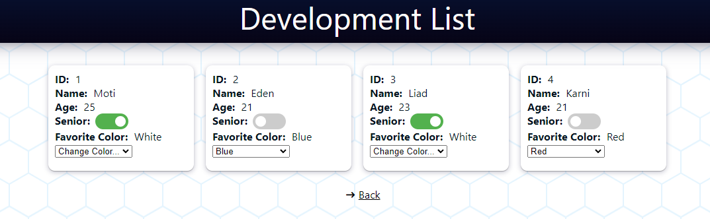
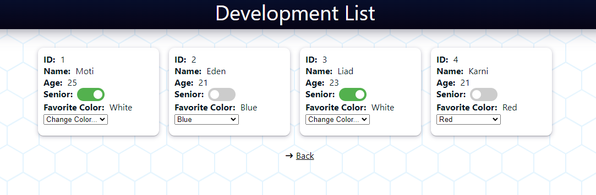
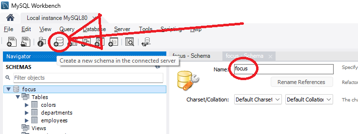

# Focus

1. 
Open MySQL Workbench and make sure the passwrod of database is:
123123
(or go to: backend/focus/settings.py and change the password in line 108)

After that, Click on "Create a new schema in the connected server" icon and insert the SQL code from git's file "MySQL.txt".
To finish click "Apply".

2.
Open new terminal:
1) cd frontend
2) npm i
3) npm start

Open second terminal:
1) cd backend
2) python manage.py runserver localhost:4000

